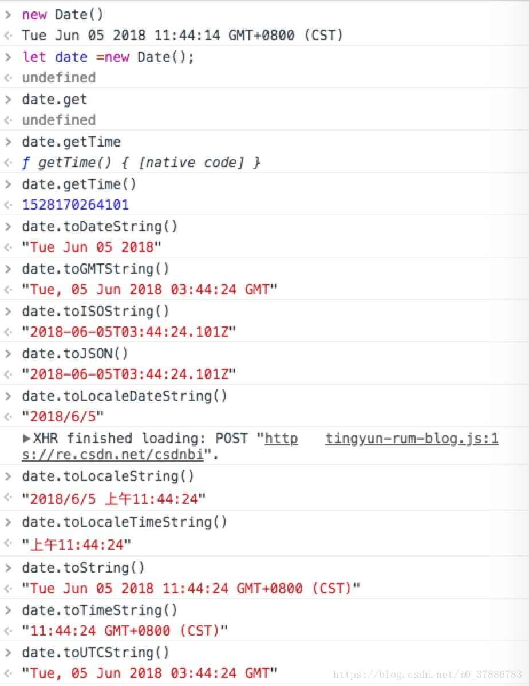

2019-01-04T15:04:10.000Z

这是UTC时间表示.
pattern 指定转化的格式，SSSZ(S指的是微秒，Z指时区)

这套时间系统被应用于许多互联网和万维网的标准中，例如，网络时间协议就是协调世界时在互联网中使用的一种方式。
在军事中，协调世界时区会使用“Z”来表示。又由于Z在无线电联络中使用“Zulu”作代称，协调世界时也会被称为"Zulu time"。
中国大陆、中国香港、中国澳门、中国台湾、蒙古国、新加坡、马来西亚、菲律宾、西澳大利亚州的时间与UTC的时差均为+8，也就是UTC+8。

TAI的起点是这样规定的：取1958年1月1日0时0分0秒世界时(UT)的瞬间作为同年同月同日0时0分0秒TAI。（事后发现，在该瞬间原子时与世界时的时刻之差为0.0039秒。这一差值就作为历史事实而保留下来。)

T是代表后面跟着“时间”。Z代表0时区，或者叫UTC统一时间。

pattern 指定转化的格式，SSSZ(S指的是微秒，Z指时区)
此处的pattern和java.text.SimpleDateFormat中的Time Patterns一致
作用：1）入参时，请求报文只需要传入yyyymmddhhmmss字符串进来，则自动转换为Date类型数据。2）出参时，Date类型的数据自动转换为14位的字符串返回出去。

之前一直对date的方法以及时区有些疑惑，这次正好趁着业务需要全部熟悉总结一下： 
- GMT: 格林威治时间 
- UTC：标准时间 
- ISO： 标准时间 
- CST：北京时间 
- 时间加Z：代表标准时间（一般和UTC时间一致） 

